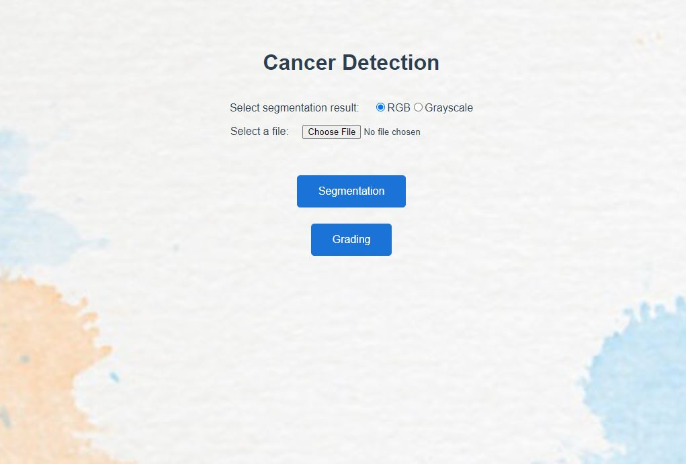

# NUS_ISS_CAPSTONE

## SECTION 1 : PROJECT TITLE
## Intelligent Cancer Detection

---
## SECTION 2 : EXECUTIVE SUMMARY / PAPER ABSTRACT
Cancer detection has always been a major issue for thepathologists and medical practitioners for diagnosis and treat-ment planning. The manual identification of cancer from mi-croscopic biopsy images is subjective in nature and may varyfrom expert to expert depending on their expertise and otherfactors which include lack of specific and accurate quantita-tive measures to classify the biopsy images as normal or can-cerous one.  The automated identification of cancerous cellsfrom microscopic biopsy images helps in alleviating. As partof this practice module project, we aim to provide a systemto automate the identification of the cancerous cells from mi-croscopic biopsy images which can be used by doctors andpathologist for early detection and treatment.  We have pro-posed a method of segmentation and classification techniquebased on the features and utilized Unet model for segmenta-tion, mobileNet for gleason grading.

---
## SECTION 3 : CREDITS / PROJECT CONTRIBUTION

| Official Full Name  | Student ID (MTech Applicable)  | Work Items (Who Did What) | Email (Optional) |
| :------------ |:---------------:| :-----| :-----|
| Zhang Yu | A0213498X | Development, Integration, Training & Documentation | e0508599@u.nus.edu |
| Natarajan Anandan | A0213514U | Project Managmeent, Busienss Analysis & DomainAnalysis,  Documentation  &  Presentations | e0508615@u.nus.edu |

---
## SECTION 4 : VIDEO PRESENTATION

[Video Presentation](https://youtu.be/F6nC36dUT6I)

---
## SECTION 5 : USER GUIDE

### [ 1 ] To run the system in windows or iss-vm

> $ git clone https://github.com/LiSheng-Chris/NUS_ISS_CAPSTONE.git

> pip install -r requirements.txt

> flask run

> **Go to URL using web browser** http://127.0.0.1:5000/

